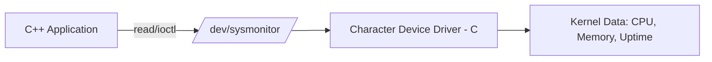
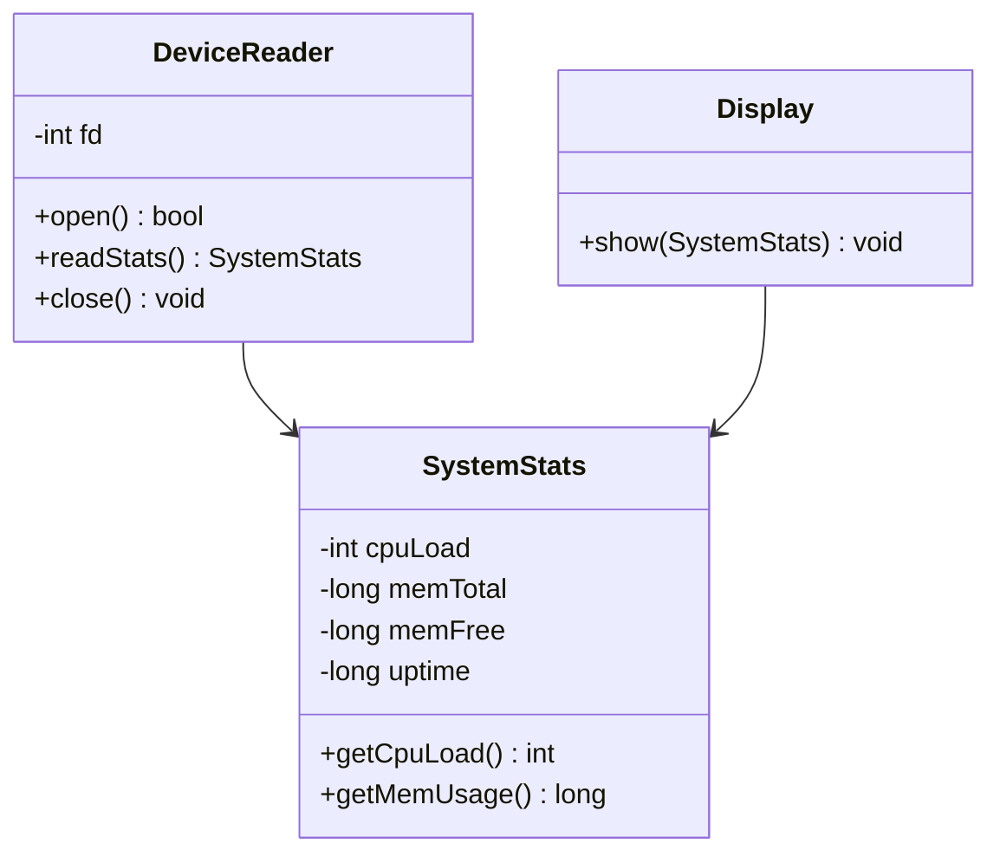
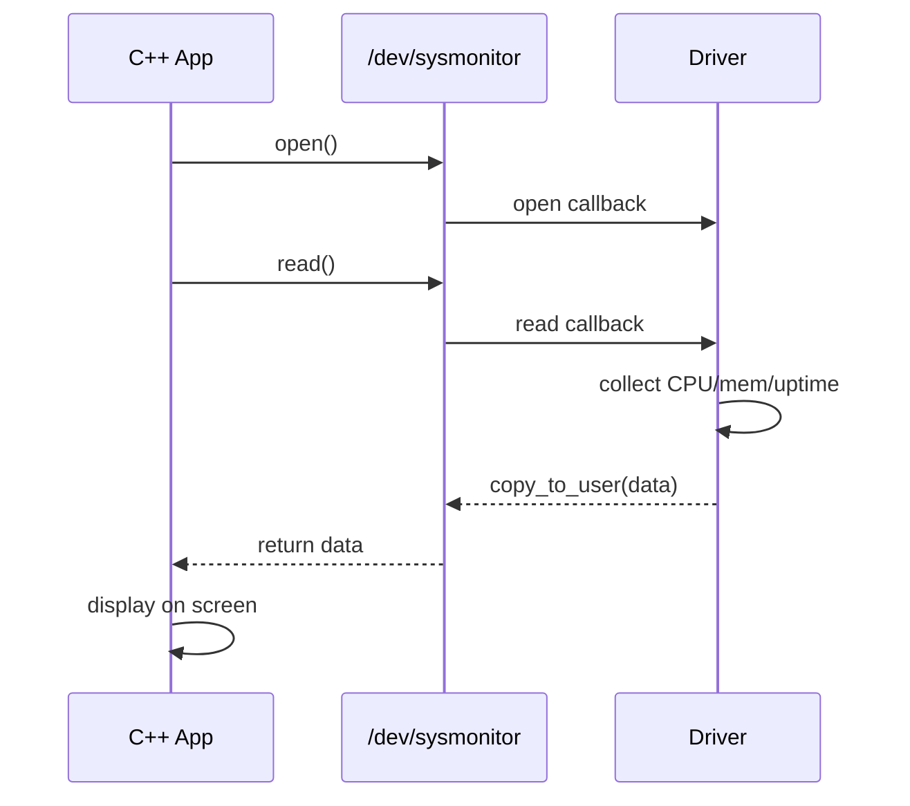
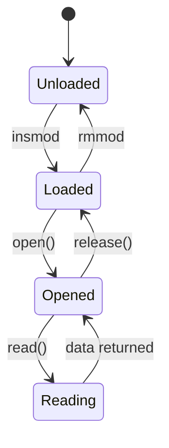

# Stage 3: System Design and Architecture

## 1. Architecture



The application opens the device file, the driver reads live kernel data,
and returns it through the read and ioctl operations.

## 2. Components and Responsibilities

- Driver (C): registers the device, implements open/read/release/ioctl,
  collects CPU, memory and uptime data, protects shared data with a mutex.
- Shared header (sysmon.h): defines the data structure and ioctl commands
  used by both the driver and the application.
- C++ Application: DeviceReader (opens and reads the device), SystemStats
  (stores the values), Display (prints them to the screen).

## 3. Data Structure

```c
struct sysmon_data {
    int cpu_load;      // percentage
    long mem_total;    // KB
    long mem_free;     // KB
    long uptime;       // seconds
};
```

## 4. Class Diagram (C++ application)



## 5. Sequence Diagram



## 6. State Machine Diagram (driver lifecycle)



## 7. Implementation Plan

1. Register the character device and add open/release (Stage 4).
2. Implement read() with dummy data, then real data (Stage 4).
3. Add the ioctl to select a metric (Stage 4-5).
4. Write the C++ classes and connect them to the device (Stage 4).
5. Test and compare with free/uptime (Stage 5).

## 8. Development Environment (already set up)

- Ubuntu VM (VirtualBox), gcc, g++, make, git, kernel headers.
- Git branches: main, develop, feature/driver.

## 9. Roadmap for Stage 4

- Register the character device.
- Implement open, read, release.
- Return dummy data first, then real data.
- Build the first version of the C++ reader.
